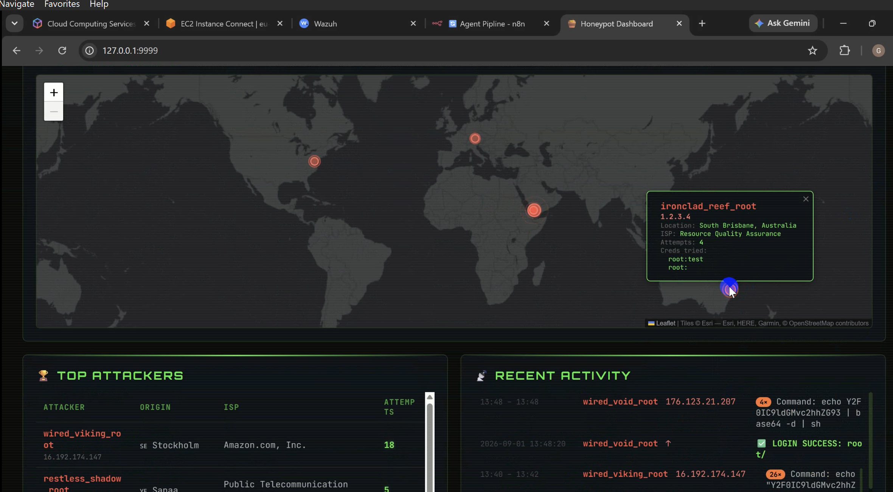
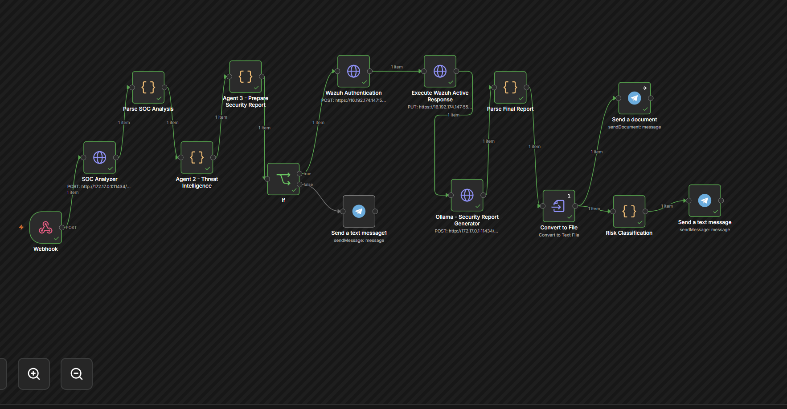
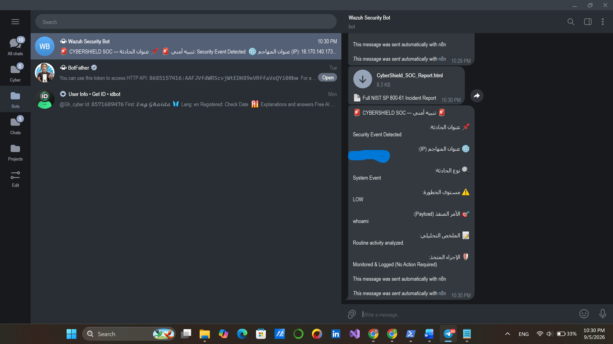
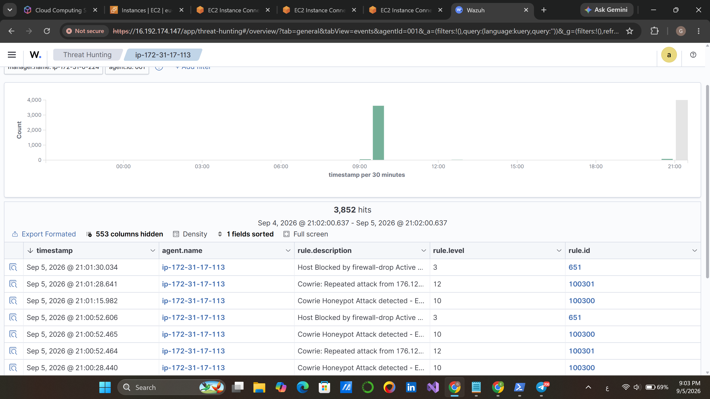
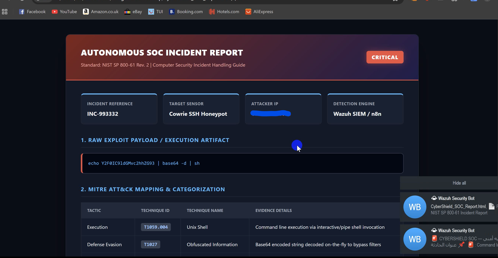

# 🛡️ CyberSOC: Autonomous SOC Analyst Pipeline
Autonomous SOC Pipeline integrating Cowrie Honeypot, Wazuh SIEM, n8n Automation, and Ollama LLM.
---

## 📸 Pipeline Demonstration & Visual Evidence

### 1. Security Operations Monitoring (Wazuh Dashboard)
Visualization of threat telemetry, alert levels, and command injection detections.

### 2. Autonomous Agent Investigation Workflow (n8n)
Orchestration pipeline integrating Wazuh SIEM webhooks, Ollama LLM triage, and automated response actions.

### 3. Real-Time Autonomous Alerting & Triaging
Live incident notification with root-cause analysis sent directly via Telegram bot.

### 4. Incident Response & Automated Mitigation
Active response trigger confirming attacker isolation and IP containment.

### 5. Automated Security Incident Report
Comprehensive incident documentation generated automatically following triage.

